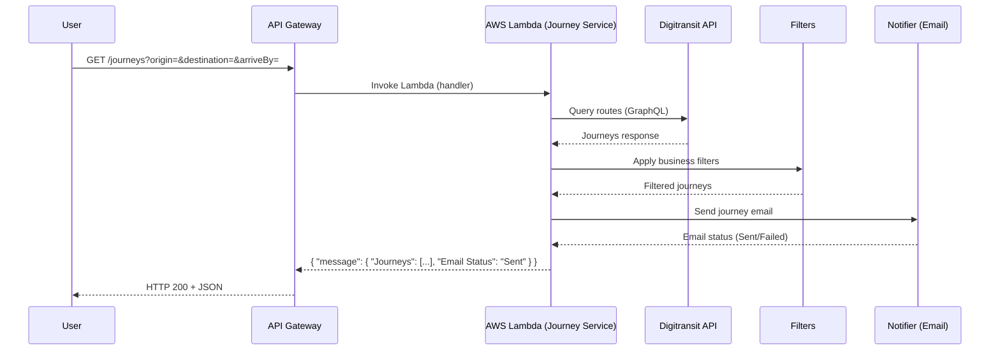
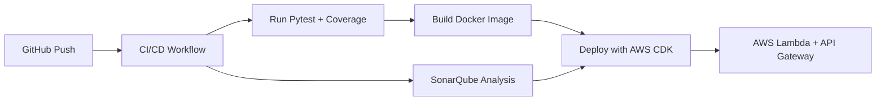

# Route Planner API

A serverless route-planning API built on **AWS Lambda**, **API Gateway**, and **AWS CDK**, integrating with the **HSL Digitransit API** to provide journey options, apply filters, and send email notifications.

---

## Features

- Query routes from [HSL Digitransit API](https://digitransit.fi/en/developers/)  
- Serverless deployment with AWS Lambda (Docker image) + API Gateway  
- Email notifications with journey details  
- Built with **Python 3.12** and **AWS Lambda Powertools**  
- Infrastructure-as-Code with **AWS CDK**  
- Unit tests with **pytest**  
- Code quality with **SonarQube**  
- CI/CD via **GitHub Actions**  

---

## Rout Planner Architecture

```
+-------------+        +--------------------+        +------------+
| API Gateway | -----> | AWS Lambda (Docker)| -----> | Digitransit|
|  /journeys  |        |  Journey Service   |        |   API      |
+-------------+        +--------------------+        +------------+
                            |       |
                            v       v
                        Filters   Notifier
                                    |
                                    v
                                  Email
```

---

## Route Planner Sequence Diagram



---

## Route Planneer Project Structure

```
route-planner-main/
├── src/journey_service/
│   ├── handler.py       # Lambda entrypoint
│   ├── digitransit.py   # Query Digitransit API
│   ├── filters.py       # Journey filtering logic
│   ├── notifier.py      # Email sending
│   └── utils.py         # Helpers
├── cdk/                 # AWS CDK stack
├── tests/               # Pytest unit tests
├── Dockerfile           # Lambda container
├── template.yaml        # SAM template
├── requirements.txt     # Python dependencies
└── .github/workflows/   # GitHub Actions (CI/CD)
```

---

## Getting Started

### 1. Clone Repo
```bash
git clone https://github.com/kone-app/route-planner.git
cd route-planner-main
```

### 2. Install Dependencies
```bash
python3 -m venv .venv
source .venv/bin/activate
pip install -r requirements.txt
```

### 3. Run Tests
```bash
pytest --maxfail=1 --disable-warnings -q
```

---

## Local Development (SAM)

```bash
sam build --use-container
sam local start-api
```

Test locally:

```
http://127.0.0.1:3000/journeys?origin=Aalto-yliopisto&destination=Keilaniemi&arriveBy=20250911084500
```

---

## Deployment (CDK)

1. Install CDK dependencies:
   ```bash
   pip install -r cdk/requirements-cdk.txt
   ```

2. Bootstrap and deploy:
   ```bash
   cdk bootstrap
   cdk deploy
   ```

This provisions:
- Lambda (Docker image)
- API Gateway endpoint
- CloudWatch logging
- IAM roles

---

## CI/CD Pipeline



- **ci-cd.yml** → Runs tests + SonarQube + deploy  
- **trigger-mail.yml** → Scheduled mail trigger  

---

## Monitoring

- **AWS Lambda Powertools**
  - Structured Logging
  - Metrics in CloudWatch
  - Tracing (X-Ray)
- **SonarQube** → code quality checks  
- **CloudWatch Logs** → Lambda execution logs  

---

## Example API Call

```bash
curl -X GET   "https://<api-id>.execute-api.<region>.amazonaws.com/prod/journeys?origin=Aalto-yliopisto&destination=Keilaniemi&arriveBy=20250911084500"
```

Response:
```json
{
  "message": {
    "Journeys": [
      {
        "duration_min": 9,
        "departure": "09:30",
        "arrival": "09:39",
        "legs": [
          {"mode": "BUS", "from": "Aalto-yliopisto (M)", "to": "Otaranta"},
          {"mode": "WALK", "from": "Otaranta", "to": "Keilaniemi"}
        ]
      }
    ],
    "Email Status": "Sent"
  }
}
```

---

## Standards & Best Practices

- Follows PEP8 naming (`latest_arrival` not `latestArrival`)  
- 100% unit test coverage with pytest  
- Secrets handled via **AWS KMS / Secrets Manager**  

---

## Next Action Item Roadmap

- [ ] Add GraphQL support  
- [ ] Persist journey history in DynamoDB  
- [ ] Add caching with API Gateway + Redis  
- [ ] Multi-channel notifications (SMS, Slack, Teams)  

---

## Contributors
- **Sushil Kumar** – Architect & Developer  
