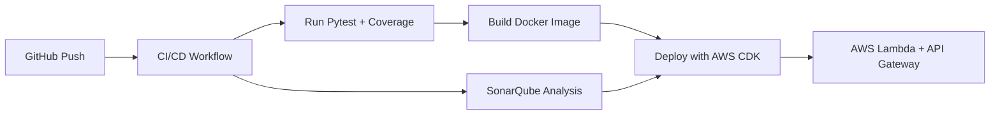

# Route Planner API

A serverless route-planning API built on **AWS Lambda**, **API Gateway**, and **AWS CDK**, integrating with the **HSL Digitransit API** to provide journey options and send email notifications.

---

## Challenge
Andrea wants to know when she should leave from Aalto Yliopisto to reach KONE Building by 08:45 on weekdays.
-	Andrea prefers REST APIs (not GraphQL).
-	She wants an email every weekday at 06:00 with journey details.
-	Solution should run both locally and in the AWS Cloud.

## Solution Overview
The solution is a serverless REST API built with AWS-native services:
-	AWS Lambda (Python 3.12) – executes API logic
-	API Gateway – exposes REST endpoints
-	EventBridge – schedules daily 06:00 triggers (Mon–Fri)
-	SES / Gmail SMTP – email notifications
-	AWS CDK (Python) – infrastructure-as-code
-	AWS SAM CLI – local development & testing

## Features

- Query routes from [HSL Digitransit API](https://digitransit.fi/en/developers/)  
- Serverless deployment with AWS Lambda (Docker image) + API Gateway  
- Email notifications with journey details  
- Built with **Python 3.12** and **AWS Lambda Powertools**  
- Infrastructure-as-Code with **AWS CDK**  
- Unit tests with **pytest**  
- Code quality with **SonarQube**  
- CI/CD via **GitHub Actions** pipeline with GitHub Actions + SonarQube

-	REST API wrapper for Digitransit GraphQL
-	Multiple journey options (5 itineraries, sorted by duration)
-	Weekend adjustment (Sat/Sun → Monday)
-	Email notifications at 06:00 weekdays
-	Observability with AWS Lambda Powertools (logs, tracing, metrics)

---

## Rout Planner Architecture

```
+-------------+        +--------------------+        +------------+
| API Gateway | -----> | AWS Lambda (Docker)| -----> | Digitransit|
|  /journeys  |        |  Journey Service   |        |   API      |
+-------------+        +--------------------+        +------------+
                           ^  |       |
                           |  v       v
                         Filters   Notifier
                                      |
                                      v
                                    Email
```
AWS Components:
-	API Gateway → Lambda → Digitransit API
-	EventBridge (cron) → Lambda → Gmail

---

## Route Planner Sequence Diagram


---

## Route Planneer Project Structure

```
route-planner/
├── cdk/                                # Infrastructure as Code (AWS CDK, IaC demo only)
│   ├── app.py
│   └── routing_stack.py                # API Gateway + Lambda definition
│
├── src/
│   └── journey_service/                # Core service logic
│       ├── __init__.py
│       ├── handler.py                  # Lambda entrypoint (Powertools)
│       ├── digitransit.py              # get_coordinates, query_journeys
│       ├── filters.py                  # filter_journeys
│       ├── notifier.py                 # send_email
│       ├── utils.py                    # time conversions
│       └── config.py                   # loads .env.{env} for dev/demo/preprod
│
├── tests/                              # Unit tests with pytest
│   ├── test_digitransit.py
│   ├── test_filters.py
│   └── test_handler.py
│
├── .env.dev                            # Local developer testing
├── .env.demo                           # Demo environment
├── .env.preprod                        # Pre-production/staging
│
├── sonar-project.properties             # SonarQube config
├── requirements.txt                     # Python dependencies
├── template.yaml                        # SAM template (run locally with `sam local start-api`)
├── README.md                            # Documentation (setup, curl examples, diagrams)
│
└── .github/
    └── workflows/
        └── ci-cd.yml                   # GitHub Actions CI/CD (build, test, sonar, deploy local/demo)
```

---

## Getting Started

### 1. Clone Repo
```bash
git clone https://github.com/kone-app/route-planner.git
cd route-planner-main
```

### 2. Install Dependencies
```bash
python3 -m venv .venv
source .venv/bin/activate
pip install -r requirements.txt
```

### 3. Run Tests
```bash
pytest --maxfail=1 --disable-warnings -q
```

---

## Local Development (SAM)

```bash
sam build --use-container
sam local start-api
```

Test locally:

```
http://127.0.0.1:3000/journeys?origin=Aalto-yliopisto&destination=Kone-Building&arriveBy=20250911084500
```
---

## Deployment (CDK)

1. Install CDK dependencies:
   ```bash
   pip install -r cdk/requirements-cdk.txt
   ```

2. Bootstrap and deploy:
   ```bash
   cdk bootstrap
   cdk deploy
   ```

This provisions:
- Lambda (Docker image)
- API Gateway endpoint
- CloudWatch logging
- IAM roles

---

## CI/CD Pipeline



- **ci-cd.yml** → Runs tests + SonarQube + deploy  
- **trigger-mail.yml** → Scheduled mail trigger  

-	**Build & Test**
	  - Python 3.12 for Lambda code
   	- Node.js 20 for AWS CDK
	  - Run pytest --cov for coverage
    - SonarQube scan
- **Deploy**
	  - CDK Bootstrap → cdk bootstrap
	  - GitHub Actions deploys to AWS
- **Schedule**
    - EventBridge cron → cron(0 6 ? * MON-FRI *)
    - Triggers Lambda at 06:00 (UTC)


---

## Monitoring

- **AWS Lambda Powertools**
  - Structured Logging
  - Metrics in CloudWatch
  - Tracing (X-Ray)
- **SonarQube** → code quality checks  
- **CloudWatch Logs** → Lambda execution logs  

---
## API Specification
# Endpoint
GET /journeys?origin=Aalto-yliopisto&destination=Kone-Building&arriveBy=20250911084500
# Parameters
-	origin – starting stop (string)
-	destination – end stop (string)
-	arriveBy – datetime (yyyyMMddHHmmss)


## Example API Call

```bash
curl -X GET   "https://<api-id>.execute-api.<region>.amazonaws.com/prod/journeys?origin=Aalto-yliopisto&destination=Kone-Building&arriveBy=20250911084500"
```

Response:
```json
{
  "message": {
    "Journeys": [
      "Route Details :-",
      "Time to leave from Aalto-yliopisto : 08:19:52",
      "Aalto-yliopisto:08:19:52  --TO-->  Aalto-yliopisto (M):08:22:00  BY-->  WALK 0:02:08 min",
      "Time to leave from Aalto-yliopisto (M) : 08:22:00",
      "Aalto-yliopisto (M):08:22:00  --TO-->  Keilaniemi:08:24:00  BY-->  SUBWAY 0:02:00 min",
      "Time to leave from Keilaniemi : 08:24:00",
      "Keilaniemi:08:24:00  --TO-->  Kone-Building:08:31:27  BY-->  WALK 0:07:27 min",
      "Total Journey Duration = 0:11:35 min",
      "",
      "",
      "Route Details :-",
      "Time to leave from Aalto-yliopisto : 08:23:52",
      "Aalto-yliopisto:08:23:52  --TO-->  Aalto-yliopisto (M):08:26:00  BY-->  WALK 0:02:08 min",
      "Time to leave from Aalto-yliopisto (M) : 08:26:00",
      "Aalto-yliopisto (M):08:26:00  --TO-->  Keilaniemi:08:28:00  BY-->  SUBWAY 0:02:00 min",
      "Time to leave from Keilaniemi : 08:28:00",
      "Keilaniemi:08:28:00  --TO-->  Kone-Building:08:35:27  BY-->  WALK 0:07:27 min",
      "Total Journey Duration = 0:11:35 min",
      "",
      "",
      "Route Details :-",
      "Time to leave from Aalto-yliopisto : 08:25:52",
      "Aalto-yliopisto:08:25:52  --TO-->  Aalto-yliopisto (M):08:28:00  BY-->  WALK 0:02:08 min",
      "Time to leave from Aalto-yliopisto (M) : 08:28:00",
      "Aalto-yliopisto (M):08:28:00  --TO-->  Keilaniemi:08:30:00  BY-->  SUBWAY 0:02:00 min",
      "Time to leave from Keilaniemi : 08:30:00",
      "Keilaniemi:08:30:00  --TO-->  Kone-Building:08:37:27  BY-->  WALK 0:07:27 min",
      "Total Journey Duration = 0:11:35 min",
      "",
      "",
      "Route Details :-",
      "Time to leave from Aalto-yliopisto : 08:29:52",
      "Aalto-yliopisto:08:29:52  --TO-->  Aalto-yliopisto (M):08:32:00  BY-->  WALK 0:02:08 min",
      "Time to leave from Aalto-yliopisto (M) : 08:32:00",
      "Aalto-yliopisto (M):08:32:00  --TO-->  Keilaniemi:08:34:00  BY-->  SUBWAY 0:02:00 min",
      "Time to leave from Keilaniemi : 08:34:00",
      "Keilaniemi:08:34:00  --TO-->  Kone-Building:08:41:27  BY-->  WALK 0:07:27 min",
      "Total Journey Duration = 0:11:35 min",
      "",
      "",
      "Route Details :-",
      "Time to leave from Aalto-yliopisto : 08:32:52",
      "Aalto-yliopisto:08:32:52  --TO-->  Aalto-yliopisto (M):08:35:00  BY-->  WALK 0:02:08 min",
      "Time to leave from Aalto-yliopisto (M) : 08:35:00",
      "Aalto-yliopisto (M):08:35:00  --TO-->  Keilaniemi:08:37:00  BY-->  SUBWAY 0:02:00 min",
      "Time to leave from Keilaniemi : 08:37:00",
      "Keilaniemi:08:37:00  --TO-->  Kone-Building:08:44:27  BY-->  WALK 0:07:27 min",
      "Total Journey Duration = 0:11:35 min",
      "",
      ""
    ],
    "Email Status": "Email Sent"
  }
}
```

---

## Standards & Best Practices

- Follows PEP8 naming (`latest_arrival` not `latestArrival`)  
- 80% unit test coverage with pytest  
- Secrets & Variables handled via **GITHUB Secret ( AWS KMS or Secrets Manager or etc can also be used )**  

---

## Future Improvement If Needed

- [ ] Add GraphQL support  
- [ ] Persist journey history in DynamoDB  
- [ ] Add caching with API Gateway + Redis  
- [ ] Multi-channel notifications (SMS, Slack, Teams)  

---
## Reading material used

* https://digitransit.fi/en/developers/apis/1-routing-api/itinerary-planning/
* https://digitransit.fi/en/developers/apis/1-routing-api/stops/
* https://powertools.aws.dev/

---

## Contributor
- **Sushil Kumar**  
